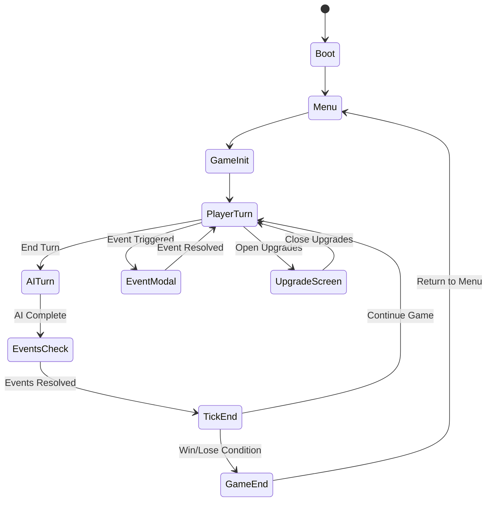
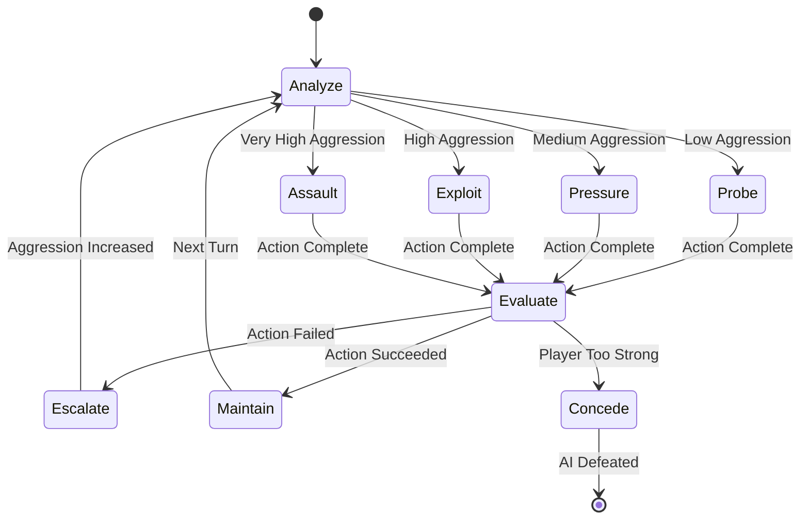

# Design Document

## Overview

Planetary Chess: Yurugu Edition is a turn-based strategy game built with Phaser 3 and TypeScript that simulates indigenous African resistance against colonial forces. The game uses a data-driven architecture with finite state machines for game flow, utility-based AI for opponents, and a modular component system for maintainability and extensibility.

The core gameplay revolves around managing four key metrics while responding to dynamic events and countering an adaptive AI opponent across a map of interconnected regions.

## Architecture

### Core Technology Stack

- **Engine**: Phaser 3 with TypeScript for type safety and maintainability
- **Build System**: Vite for fast development and optimized production builds
- **State Management**: XState for finite state machines managing game flow and AI behavior
- **Data Storage**: IndexedDB via idb library for persistent game saves
- **Audio**: Howler.js for cross-platform audio management
- **Internationalization**: i18next with JSON language bundles
- **Mobile Deployment**: Capacitor for PWA-to-native app wrapping
- **Map Authoring**: Tiled editor with JSON export for region definitions

### Project Structure

```
/planetary-chess-yurugu
  /assets           # Images, spritesheets, audio, fonts
  /maps             # Tiled .tmx + exported .json files
  /data             # Game content in JSON format
    civilizations.json
    /events         # Event definitions
    /upgrades       # Upgrade system data
    /balancing      # Game balance parameters
  /src
    /core           # Boot sequence, configuration, asset loaders
    /scenes         # Phaser scenes (Boot, Menu, Map, EventModal, Upgrades, Codex)
    /systems        # Game logic (resources, AI, events, upgrades, save/load)
    /ui             # UI overlays and components
    /fsm            # XState state machines
    /types          # TypeScript type definitions
```

### Data-Driven Architecture

All game content is externalized to JSON files, enabling:
- Easy content updates without code changes
- Modding support through data file replacement
- Localization through separate content files
- Balance adjustments via configuration

## Components and Interfaces

### Core Game State

```typescript
interface GameState {
  turn: number;
  metrics: {
    spiritualIntegrity: number;
    economicIndependence: number;
    culturalImmunity: number;
    socialCohesion: number;
  };
  currency: {
    faith: number;
    culturePoints: number;
    defense: number;
    food: number;
    tradeGoods: number;
  };
  regions: Region[];
  colonizerAggro: number; // Utamaroho escalation level (0-100)
  ownedUpgrades: string[];
  eventHistory: string[];
}
```

### Region System

```typescript
interface Region {
  id: string;
  name: string;
  biome: 'forest' | 'lake' | 'plains' | 'trade_path' | 'mines' | 'village' | 'plateau';
  risk: 'low' | 'medium' | 'high' | 'veryHigh';
  owner: 'player' | 'colonizer' | 'neutral';
  resources: Partial<Record<'food' | 'faith' | 'tradeGoods' | 'defense' | 'culturePoints', number>>;
  position: { x: number; y: number }; // Map coordinates
  connections: string[]; // Connected region IDs
}
```

### Event System

```typescript
interface PCEvent {
  id: string;
  title: string;
  description: string;
  icon?: string;
  conditions?: {
    turnGTE?: number;
    turnLTE?: number;
    'region.biome'?: string;
    'metric.min'?: Record<string, number>;
    'currency.min'?: Record<string, number>;
  };
  choices: EventChoice[];
}

interface EventChoice {
  id: string;
  label: string;
  description?: string;
  effects?: Partial<GameState['metrics']> & Partial<GameState['currency']>;
  risks?: { retaliation?: number; failure?: number };
  longTerm?: Partial<Record<keyof GameState['metrics'], number>>;
  conditions?: Record<string, unknown>;
}
```

### Upgrade System

```typescript
interface Upgrade {
  id: string;
  name: string;
  description: string;
  category: 'spiritual' | 'community' | 'knowledge' | 'defense';
  cost: Partial<GameState['currency']>;
  effects: {
    metrics?: Partial<GameState['metrics']>;
    currency?: Partial<GameState['currency']>;
    passive?: string[]; // Passive effect IDs
  };
  prerequisites?: string[]; // Required upgrade IDs
  icon: string; // Adinkra/Ifá symbol reference
}
```

## Game Flow State Machine

### Primary Game Loop



### AI Behavior State Machine



## AI System Design

### Utility-Based Decision Making

The Colonizer AI uses a utility scoring system that evaluates potential actions based on:

1. **Target Identification**: Identifies the player's weakest metric
2. **Action Selection**: Chooses tactics that exploit the identified weakness
3. **Escalation Management**: Increases aggression (Utamaroho) based on failure/success
4. **Adaptive Strategy**: Switches focus as player metrics change

### AI Action Categories

- **Spiritual Attacks**: Missionary activities, religious conversion pressure
- **Economic Pressure**: Trade restrictions, resource manipulation
- **Cultural Erosion**: Educational systems, language suppression
- **Social Division**: Tribal conflicts, leadership challenges

### Escalation System

The Utamaroho (aggression) scalar (0-100) determines AI behavior intensity:
- 0-25: Probe (subtle influence attempts)
- 26-50: Pressure (direct but limited actions)
- 51-75: Exploit (aggressive multi-vector attacks)
- 76-100: Assault (all-out domination attempts)

## Rendering and Performance

### Map Rendering Strategy

1. **Base Layer**: Static terrain tiles rendered once and cached as RenderTexture
2. **Region Layer**: Interactive polygon overlays with hover/selection states
3. **UI Layer**: HUD elements and modal overlays
4. **Effect Layer**: Temporary animations and visual feedback

### Mobile Optimization

- Texture atlases for reduced draw calls
- Static layer caching to minimize re-renders
- Touch-friendly UI scaling and hit areas
- Frame rate capping and background throttling
- Asset compression and progressive loading

### Memory Management

- Lazy loading of audio assets
- Texture cleanup for unused scenes
- Event listener cleanup on scene transitions
- IndexedDB connection pooling

## Data Models

### Save Game Schema

```typescript
interface SaveGame {
  version: string;
  timestamp: number;
  gameState: GameState;
  metadata: {
    playTime: number;
    difficulty: string;
    playerName?: string;
  };
}
```

### Configuration Schema

```typescript
interface GameConfig {
  difficulty: {
    aiAggressionMultiplier: number;
    eventFrequency: number;
    resourceScarcity: number;
  };
  balance: {
    startingMetrics: GameState['metrics'];
    startingCurrency: GameState['currency'];
    victoryThresholds: {
      regionControl: number;
      turnLimit: number;
      metricMinimum: number;
    };
  };
  ui: {
    animationSpeed: number;
    soundVolume: number;
    musicVolume: number;
  };
}
```

## Error Handling

### Save System Error Recovery

- Automatic backup saves every 3 turns
- Corruption detection with fallback to previous save
- Graceful degradation when IndexedDB unavailable
- Export/import functionality for save transfer

### Network and Asset Loading

- Retry logic for failed asset loads
- Fallback assets for missing content
- Offline mode detection and adaptation
- Progressive enhancement for optional features

### Game State Validation

- Schema validation for loaded save games
- Metric bounds checking and correction
- Region ownership consistency verification
- Event condition validation before triggering

## Testing Strategy

### Unit Testing

- Game state mutations and calculations
- Event system logic and condition evaluation
- AI utility scoring and decision making
- Save/load functionality and data integrity

### Integration Testing

- Scene transitions and state persistence
- XState machine behavior and transitions
- Asset loading and caching systems
- Mobile touch interaction and responsive UI

### Performance Testing

- Frame rate stability across devices
- Memory usage profiling and leak detection
- Asset loading time optimization
- Battery usage on mobile devices

### Accessibility Testing

- Screen reader compatibility for UI elements
- Keyboard navigation support
- Color contrast and visual clarity
- Touch target size and spacing

## Deployment and Distribution

### Progressive Web App

- Service worker for offline asset caching
- Web app manifest for installation prompts
- Background sync for analytics data
- Push notifications for turn-based multiplayer (future)

### Mobile App Packaging

- Capacitor configuration for iOS and Android
- Native plugin integration for device features
- App store optimization and metadata
- In-app purchase integration (future monetization)

### Analytics and Monitoring

- PostHog integration for user behavior tracking
- Error reporting and crash analytics
- Performance metrics collection
- A/B testing framework for balance changes

This design provides a solid foundation for implementing the Planetary Chess: Yurugu Edition game while maintaining flexibility for future enhancements and platform expansion.